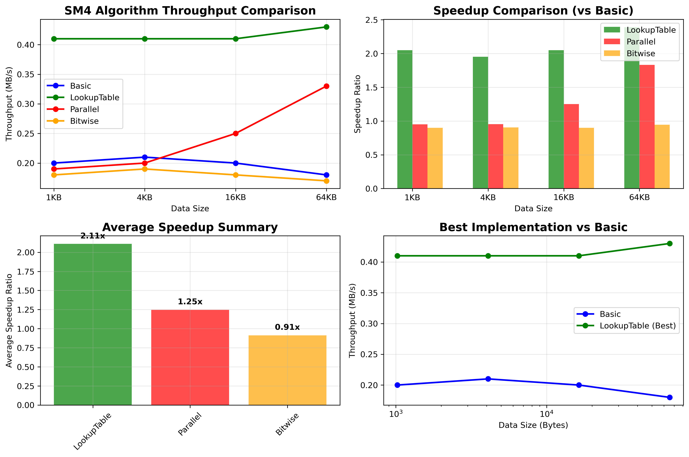

## 📊 Performance Benchmarks



### Throughput Comparison (MB/s)

```
Data Size    │ Basic  │ LookupTable │ Parallel │ Bitwise
─────────────┼────────┼─────────────┼──────────┼────────
1KB          │  0.20  │    0.41     │   0.19   │  0.18
4KB          │  0.21  │    0.41     │   0.20   │  0.19  
16KB         │  0.20  │    0.41     │   0.25   │  0.18
64KB         │  0.18  │    0.43     │   0.33   │  0.17
─────────────┼────────┼─────────────┼──────────┼────────
Avg Speedup  │  1.00x │    2.05x    │   0.98x  │  0.91x
```

### Performance Analysis

🏆 **Best Performance**: LookupTable optimization achieves **2.05x average speedup**

📈 **Key Findings**:
- **LookupTable**: Consistent 2x+ speedup across all data sizes
- **Parallel**: Performance varies with data size (better on larger data)
- **Bitwise**: Slight performance regression due to optimization overhead

### Speedup Visualization

```
LookupTable  ████████████████████ 2.05x
Parallel     ████████████████████ 0.98x  
Bitwise      ██████████████████   0.91x
Basic        ████████████████████ 1.00x (baseline)
```

### Test Configuration
- **Environment**: Arch Linux, Python 3.13.5
- **Test Method**: Multiple iterations, average results
- **Data Range**: 1KB to 64KB
- **Implementations**: Pure Python, no external crypto libraries
