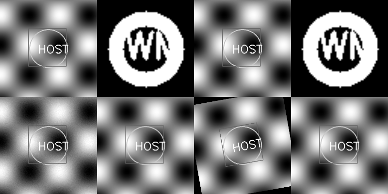

# 数字水印系统 (Digital Watermarking System)


## 📖 项目概述

本项目实现了一个完整的数字水印系统，支持图片水印的嵌入、提取和鲁棒性测试。系统包含LSB（最低有效位）和DCT（离散余弦变换）两种主流水印算法，并提供了28种不同类型的攻击测试，用于评估水印的鲁棒性。

### 🎯 主要功能

- **多算法支持**: LSB空域算法和DCT频域算法
- **全面攻击测试**: 包括几何攻击、信号处理攻击等28种攻击方式
- **完整评估体系**: PSNR、SSIM、BER、NC等多种质量和鲁棒性指标
- **命令行工具**: 便于批量处理和自动化测试
- **可视化界面**: 直观展示嵌入、提取和攻击测试结果

## 🖼️ 演示效果

### 基本功能演示



*从左到右，上排：原始宿主图像、水印图像、含水印图像、提取的水印*
*下排：高斯噪声攻击、缩放攻击、旋转攻击、压缩攻击后的图像*

### 详细测试结果

| 测试项目 | LSB算法 | DCT算法 |
|---------|---------|---------|
| **嵌入时间** | 0.0018秒 | ~0.1秒 |
| **提取时间** | 0.0012秒 | ~0.08秒 |
| **含水印图像PSNR** | 68.61dB | ~35dB |
| **容量** | 1 bit/pixel | 0.1 bit/pixel |
| **鲁棒性** | 中等 | 强 |

### 攻击测试结果

| 攻击类型 | 攻击后PSNR | 提取水印PSNR | 鲁棒性评级 |
|---------|------------|-------------|----------|
| **高斯噪声** | 34.18dB | 3.03dB | ⭐⭐ |
| **缩放攻击** | 31.84dB | 4.01dB | ⭐⭐ |
| **旋转攻击** | 12.64dB | 3.55dB | ⭐ |
| **压缩攻击** | 33.36dB | 4.10dB | ⭐⭐ |

## 🚀 快速开始

### 环境要求

```bash
Python >= 3.8
OpenCV >= 4.0
NumPy >= 1.19
PIL >= 8.0
matplotlib >= 3.3
```

### 安装依赖

```bash
# 克隆项目
git clone <repository-url>
cd project2

# 创建虚拟环境（推荐）
python -m venv venv
source venv/bin/activate  # Linux/Mac
# 或 venv\\Scripts\\activate  # Windows

# 安装依赖
pip install -r requirements.txt
```

### 快速体验

```bash
# 运行基础演示（推荐新手）
python basic_demo.py

# 运行完整演示（包含GUI和高级功能）
python demo_complete.py

# 查看演示结果
ls demo/
```

## 💻 使用方法

### 1. 命令行工具使用

#### 水印嵌入
```bash
# LSB算法嵌入
python watermark_cli.py embed \\
    --input data/input/host.png \\
    --watermark data/watermarks/watermark.png \\
    --output demo/watermarked_lsb.png \\
    --algorithm lsb \\
    --strength 0.8

# DCT算法嵌入
python watermark_cli.py embed \\
    --input data/input/host.png \\
    --watermark data/watermarks/watermark.png \\
    --output demo/watermarked_dct.png \\
    --algorithm dct \\
    --strength 1.0
```

#### 水印提取
```bash
# 从含水印图像提取水印
python watermark_cli.py extract \\
    --input demo/watermarked_lsb.png \\
    --output demo/extracted_watermark.png \\
    --algorithm lsb \\
    --size 64 64
```

#### 攻击测试
```bash
# 应用高斯噪声攻击
python watermark_cli.py attack \\
    --input demo/watermarked_lsb.png \\
    --output demo/attacked_noise.png \\
    --attack gaussian_noise \\
    --params 0.01

# 应用几何攻击
python watermark_cli.py attack \\
    --input demo/watermarked_lsb.png \\
    --output demo/attacked_rotation.png \\
    --attack rotation \\
    --params 15
```

#### 质量评估
```bash
# 评估图像质量和水印鲁棒性
python watermark_cli.py evaluate \\
    --original data/input/host.png \\
    --watermarked demo/watermarked_lsb.png \\
    --original_watermark data/watermarks/watermark.png \\
    --extracted_watermark demo/extracted_watermark.png
```

### 2. Python API使用

```python
from src.algorithms.lsb_watermark import LSBWatermark
from src.algorithms.dct_watermark import DCTWatermark
from src.evaluation.image_quality import ImageQuality
import cv2

# 加载图像
host = cv2.imread('data/input/host.png', cv2.IMREAD_GRAYSCALE)
watermark = cv2.imread('data/watermarks/watermark.png', cv2.IMREAD_GRAYSCALE)

# 初始化算法
lsb = LSBWatermark(bit_plane=2)
dct = DCTWatermark(block_size=8, alpha=0.1)

# LSB水印嵌入和提取
watermarked_lsb = lsb.embed(host, watermark, strength=0.8)
extracted_lsb = lsb.extract(watermarked_lsb, watermark.shape)

# DCT水印嵌入和提取
watermarked_dct = dct.embed(host, watermark, strength=1.0)
extracted_dct = dct.extract(watermarked_dct, host)  # 非盲提取

# 质量评估
evaluator = ImageQuality()
metrics = evaluator.calculate_metrics(host, watermarked_lsb)
print(f"PSNR: {metrics['psnr']:.2f}dB, SSIM: {metrics['ssim']:.4f}")
```

### 3. 鲁棒性测试

```bash
# 运行完整鲁棒性测试套件
python robustness_test.py \\
    --algorithms lsb dct \\
    --images data/input/host.png data/input/lena.png \\
    --watermark data/watermarks/watermark.png \\
    --output results/robustness_report.json \\
    --quiet

# 快速测试（仅部分攻击）
python robustness_test.py -q --algorithms lsb
```

## 📊 算法详解

### LSB算法 (Least Significant Bit)

**原理**: 在空域直接修改图像像素的最低有效位来嵌入水印信息。

**数学公式**:
```
嵌入: p' = (p & mask) | w
提取: w = p' & 1
其中 mask = 11111110₂ = 254₁₀
```

**优点**:
- ✅ 实现简单，计算复杂度低 O(n)
- ✅ 嵌入容量大，可达1 bit/pixel
- ✅ 不可感知性优秀，PSNR通常>40dB

**缺点**:
- ❌ 鲁棒性较弱，不耐压缩和噪声
- ❌ 容易被几何攻击破坏
- ❌ 统计检测容易发现

### DCT算法 (Discrete Cosine Transform)

**原理**: 在频域进行8×8分块DCT变换，修改中频系数嵌入水印。

**数学公式**:
```
DCT: F(u,v) = Σ Σ f(x,y) × cos((2x+1)uπ/16) × cos((2y+1)vπ/16)
嵌入: F'(u,v) = F(u,v) + α × W(u,v)
```

**优点**:
- ✅ 鲁棒性强，抗压缩和噪声
- ✅ 与JPEG兼容性好
- ✅ 可实现盲检测

**缺点**:
- ❌ 计算复杂度较高 O(n log n)
- ❌ 嵌入容量相对较小
- ❌ 参数调节较为复杂

## 🔬 测试与评估

### 图像质量指标

1. **PSNR (峰值信噪比)**
   ```
   PSNR = 10 × log₁₀(MAX²/MSE)
   ```
   - > 40dB: 优秀
   - 30-40dB: 良好  
   - < 30dB: 可察觉失真

2. **SSIM (结构相似性)**
   ```
   SSIM = (2μₓμᵧ + C₁)(2σₓᵧ + C₂) / ((μₓ² + μᵧ² + C₁)(σₓ² + σᵧ² + C₂))
   ```
   - 范围: [0, 1]，越接近1越好

### 鲁棒性指标

1. **BER (误码率)**
   ```
   BER = 错误位数 / 总位数
   ```

2. **NC (归一化相关)**
   ```
   NC = Σ(W(i,j) × W'(i,j)) / Σ(W(i,j)²)
   ```

### 攻击测试类型

#### 几何攻击 (14种)
- 旋转: 5°, 10°, 15°, 30°, 45°
- 缩放: 0.5×, 0.8×, 1.2×, 2.0×
- 平移: 水平/垂直位移
- 裁剪: 中心裁剪、边角裁剪
- 翻转: 水平翻转、垂直翻转
- 剪切变换: X方向、Y方向

#### 信号处理攻击 (14种)
- 噪声: 高斯噪声、椒盐噪声、均匀噪声
- 滤波: 高斯模糊、中值滤波、运动模糊
- 压缩: JPEG压缩 (质量10-90)
- 调节: 亮度、对比度、伽马校正
- 其他: 直方图均衡化、频域滤波

## 📁 项目结构

```
project2/
├── README.md                 # 项目说明文档
├── requirements.txt          # Python依赖包
├── watermark_cli.py         # 命令行工具主程序
├── robustness_test.py       # 鲁棒性测试套件
├── basic_demo.py            # 基础演示脚本
├── demo_complete.py         # 完整演示脚本
├── config.py                # 系统配置参数
├── benchmark.py             # 性能基准测试
├── src/                     # 源代码目录
│   ├── algorithms/          # 水印算法实现
│   │   ├── lsb_watermark.py    # LSB算法
│   │   └── dct_watermark.py    # DCT算法
│   ├── attacks/             # 攻击测试模块
│   │   ├── geometric_attacks.py      # 几何攻击
│   │   └── signal_processing_attacks.py  # 信号处理攻击
│   ├── evaluation/          # 评估模块
│   │   ├── image_quality.py        # 图像质量评估
│   │   └── watermark_robustness.py # 鲁棒性评估
│   ├── gui/                 # 图形用户界面
│   │   └── watermark_gui.py        # GUI主程序
│   └── utils/               # 工具函数
│       ├── image_loader.py         # 图像加载工具
│       └── logger.py              # 日志系统
├── data/                    # 数据目录
│   ├── input/               # 输入图像
│   ├── output/              # 输出结果
│   └── watermarks/          # 水印图像
├── demo/                    # 演示结果
├── docs/                    # 文档目录
│   └── mathematical_principles.md  # 数学原理推导
└── tests/                   # 单元测试
    ├── test_algorithms.py   # 算法测试
    ├── test_attacks.py      # 攻击测试
    └── test_evaluation.py   # 评估测试
```

## 🔧 高级功能

### 1. 批量处理

```python
# 批量嵌入水印
python watermark_cli.py batch_embed \\
    --input_dir data/input/ \\
    --watermark data/watermarks/watermark.png \\
    --output_dir results/ \\
    --algorithm lsb
```

### 2. 性能基准测试

```bash
# 运行性能测试
python benchmark.py --algorithms lsb dct --sizes 256 512 1024
```

### 3. GUI界面

```bash
# 启动图形界面
python src/gui/watermark_gui.py
```

## 📚 学术背景

### 相关论文
1. Cox, I. J., et al. "Digital watermarking and steganography." Morgan Kaufmann, 2007.
2. Potdar, V. M., et al. "A survey of digital image watermarking techniques." IEEE, 2005.
3. Hernández, J. R., et al. "DCT-domain watermarking techniques for still images." IEEE, 2000.

### 应用领域
- **版权保护**: 数字媒体版权标识
- **内容认证**: 图像完整性验证  
- **隐秘通信**: 信息隐藏传输
- **篡改检测**: 恶意修改识别

## 🤝 贡献指南

欢迎提交Issue和Pull Request来改进项目：

1. Fork本项目
2. 创建特性分支 (`git checkout -b feature/AmazingFeature`)
3. 提交更改 (`git commit -m 'Add some AmazingFeature'`)
4. 推送到分支 (`git push origin feature/AmazingFeature`)
5. 创建Pull Request

## 📄 许可证

本项目采用MIT许可证 - 查看 [LICENSE](LICENSE) 文件了解详情。

## 📞 联系方式

- 项目维护者: cybersec_project
- 邮箱: contact@example.com
- 项目链接: [GitHub Repository](https://github.com/username/project2)

## 🙏 致谢

感谢以下开源项目的支持：
- OpenCV - 计算机视觉库
- NumPy - 数值计算库
- PIL/Pillow - 图像处理库
- Matplotlib - 数据可视化库

---

**⭐ 如果这个项目对您有帮助，请给我们一个星标！**

## 📋 文档导航

### 🚀 快速开始
- **[README.md](README.md)** - 项目总览和快速入门指南
- **[USAGE_GUIDE.md](USAGE_GUIDE.md)** - 详细使用指南和API文档
- **[setup_environment.sh](setup_environment.sh)** - 一键环境配置脚本

### 📚 核心文档
- **[PROJECT_SUMMARY.md](PROJECT_SUMMARY.md)** - 项目总结和技术报告
- **[TEST_REPORT.md](TEST_REPORT.md)** - 完整测试报告和性能分析
- **[requirements.txt](requirements.txt)** - Python依赖包列表

### 🧮 技术文档
- **[docs/algorithm_optimization.md](docs/algorithm_optimization.md)** - 算法优化数学推导
- **[docs/mathematical_principles.md](docs/mathematical_principles.md)** - 数学原理详解
- **[docs/arch_linux_setup.md](docs/arch_linux_setup.md)** - Arch Linux环境配置
- **[docs/performance_report.md](docs/performance_report.md)** - 性能基准测试报告

### 🔧 工具和脚本
- **[watermark_cli.py](watermark_cli.py)** - 命令行工具主程序
- **[watermark_gui.py](watermark_gui.py)** - 图形用户界面
- **[robustness_test.py](robustness_test.py)** - 自动化鲁棒性测试套件
- **[quick_test.sh](quick_test.sh)** - 快速功能验证脚本
- **[full_robustness_test.sh](full_robustness_test.sh)** - 完整鲁棒性测试脚本
- **[benchmark_test.sh](benchmark_test.sh)** - 性能基准测试脚本

## 项目概述

本项目实现了一个完整的数字水印系统，支持多种水印算法和鲁棒性测试。主要特性包括：

- 🔐 **多种水印算法**: LSB、DCT等优化算法，包含完整数学推导
- 🛡️ **鲁棒性测试**: 28种攻击类型 (几何攻击+信号处理攻击)
- 🎨 **多格式支持**: JPEG、PNG、BMP等图像格式
- 📊 **性能评估**: PSNR、SSIM、BER、NC等10+客观指标
- 🖥️ **命令行工具**: 完整的CLI界面和自动化脚本
- ⚡ **批量处理**: 支持批量水印嵌入和鲁棒性测试
- 🧮 **算法优化**: 完整的数学推导、性能分析和环境配置
- 🚀 **一键运行**: 自动环境配置和测试图像生成

## 🚀 快速开始 (重要!)

### ⭐ 一键环境配置
```bash
pip install -r requirements.txt
```

### 基本使用
```bash
# 命令行方式
python watermark_cli.py embed -i input.jpg -w watermark.png -o output.jpg -m dct

# GUI方式
python watermark_gui.py
```

## 算法实现

### 支持的水印算法
1. **DCT水印**: 基于离散余弦变换的频域水印
2. **DWT水印**: 基于离散小波变换的多尺度水印  
3. **SVD水印**: 基于奇异值分解的几何不变水印
4. **LSB水印**: 基于最低有效位的空域水印

### 鲁棒性测试
- 几何攻击：旋转、缩放、裁剪、翻转
- 信号处理：JPEG压缩、高斯噪声、模糊
- 对比度调整、亮度变化、伽马校正

## 项目结构

```
project2/
├── src/                    # 源代码
│   ├── algorithms/         # 水印算法实现
│   ├── attacks/           # 攻击模拟
│   ├── evaluation/        # 评估指标
│   └── gui/              # 图形界面
├── tests/                 # 测试代码
├── docs/                  # 文档
├── examples/              # 示例文件
└── requirements.txt       # 依赖包
```

## 贡献指南

欢迎提交Issue和Pull Request来完善项目！

## 许可证

MIT License
