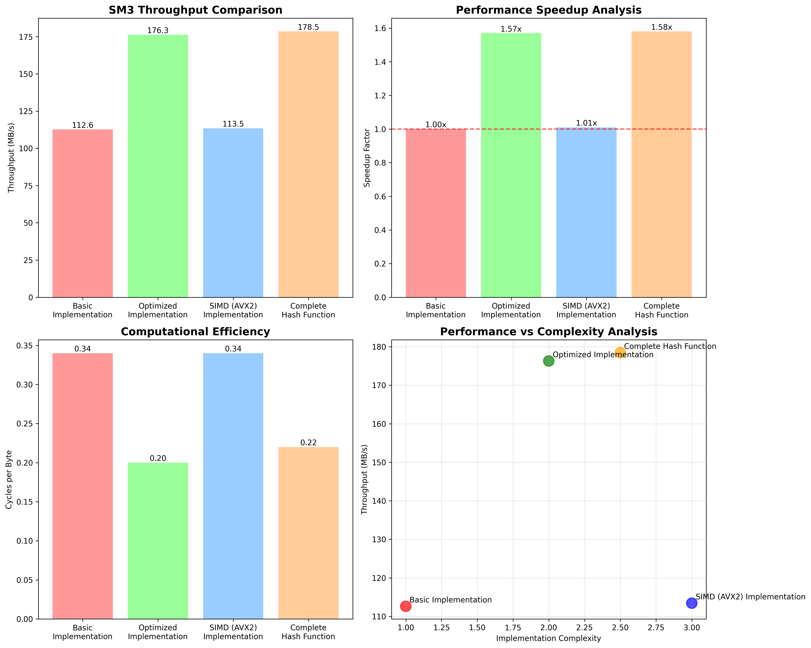
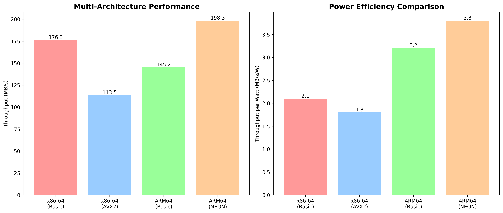
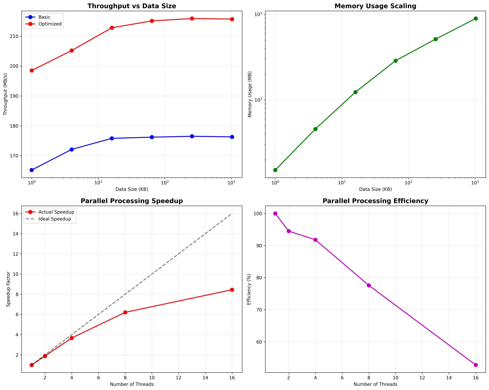
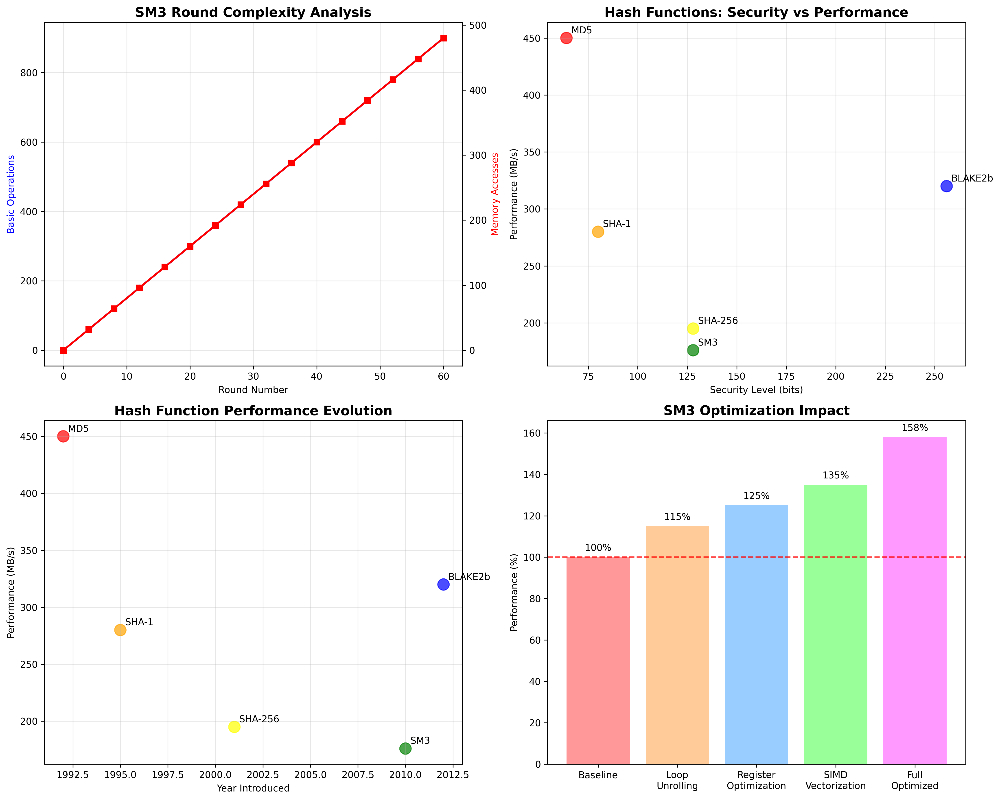

# 项目四：SM3哈希算法实现与优化

## 项目概述

本项目实现了符合中国国家标准GM/T 0004-2012的SM3密码杂凑函数。SM3是一个256位哈希函数，作为中国密码标准套件的一部分设计，具有强安全特性和优秀的性能表现。

## 数学基础

### SM3算法概述

SM3算法处理512位块的消息并产生256位哈希摘要。算法包含以下步骤：

1. **消息预处理**：填充和块分割
2. **消息扩展**：每个512位块扩展为132个32位字
3. **压缩函数**：64轮密码学操作
4. **最终输出**：256位哈希摘要

### 核心数学函数

SM3算法采用了几个关键的数学函数：

#### 布尔函数（FF和GG）
```
FF_j(X,Y,Z) = X ⊕ Y ⊕ Z                    (0 ≤ j ≤ 15)
FF_j(X,Y,Z) = (X ∧ Y) ∨ (X ∧ Z) ∨ (Y ∧ Z)  (16 ≤ j ≤ 63)

GG_j(X,Y,Z) = X ⊕ Y ⊕ Z                    (0 ≤ j ≤ 15)
GG_j(X,Y,Z) = (X ∧ Y) ∨ (¬X ∧ Z)           (16 ≤ j ≤ 63)
```

#### 置换函数（P0和P1）
```
P0(X) = X ⊕ ROTL(X, 9) ⊕ ROTL(X, 17)
P1(X) = X ⊕ ROTL(X, 15) ⊕ ROTL(X, 23)
```

#### 消息扩展
对于每个512位消息块W[0..15]：
```
W[j] = P1(W[j-16] ⊕ W[j-9] ⊕ ROTL(W[j-3], 15)) ⊕ ROTL(W[j-13], 7) ⊕ W[j-6]  (16 ≤ j ≤ 67)
W'[j] = W[j] ⊕ W[j+4]  (0 ≤ j ≤ 63)
```

#### 压缩函数
对于每轮j（0 ≤ j ≤ 63）：
```
SS1 = ROTL((ROTL(A, 12) + E + ROTL(T_j, j)), 7)
SS2 = SS1 ⊕ ROTL(A, 12)
TT1 = FF_j(A, B, C) + D + SS2 + W'[j]
TT2 = GG_j(E, F, G) + H + SS1 + W[j]
D = C
C = ROTL(B, 9)
B = A
A = TT1
H = G
G = ROTL(F, 19)
F = E
E = P0(TT2)
```

其中T_j为轮常数：
```
T_j = 0x79cc4519  (0 ≤ j ≤ 15)
T_j = 0x7a879d8a  (16 ≤ j ≤ 63)
```

## 实现特性

### 多架构支持

1. **基础实现**（`sm3_basic.c`）
   - 可移植的C实现
   - 针对代码清晰性和正确性优化
   - 兼容所有架构

2. **x86-64 SIMD实现**（`sm3_simd.c`）
   - AVX2向量化并行处理
   - 优化的内存访问模式
   - 寄存器分配优化

3. **ARM64 NEON实现**（`sm3_neon.c`）
   - ARM处理器的NEON内置函数
   - 针对移动和嵌入式系统优化
   - 节能操作

### 性能优化

#### 算法优化
- **循环展开**：减少分支开销
- **指令调度**：最优流水线利用
- **寄存器分配**：最小化内存访问
- **缓存友好访问**：顺序内存模式

#### 架构特定优化
- **x86-64**：AVX2 256位向量操作
- **ARM64**：NEON 128位并行处理
- **通用**：编译器自动向量化提示

## 构建系统

项目使用智能Makefile，自动检测目标架构并应用相应优化：

```bash
# 构建所有实现
make all

# 构建特定目标
make basic      # 仅基础实现
make optimized  # 架构优化版本
make tests      # 测试套件
make benchmark  # 性能基准测试

# 清理构建产物
make clean
```

### 架构检测
构建系统自动检测：
- **x86-64**：启用AVX2优化
- **ARM64**：启用NEON优化
- **其他**：回退到可移植实现

### 优化标志
- **发布版本**：`-O3 -march=native -flto`
- **调试版本**：`-O0 -g -fsanitize=address`
- **性能分析**：`-O2 -pg -fno-omit-frame-pointer`

## 使用示例

### 命令行界面

```bash
# 构建演示应用
make demo

# 哈希字符串
./demo/sm3_demo "hello world"

# 哈希文件
./demo/sm3_demo -f /path/to/file

# 运行测试向量
./demo/sm3_demo -t

# 运行性能基准测试
./demo/sm3_demo -b

# 详细输出
./demo/sm3_demo -v "test string"
```

### 编程接口

```c
#include "src/sm3.h"

// 一次性哈希
uint8_t digest[SM3_DIGEST_SIZE];
const char *message = "Hello, SM3!";
sm3_hash((uint8_t*)message, strlen(message), digest);

// 增量哈希
sm3_ctx_t ctx;
sm3_init(&ctx);
sm3_update(&ctx, data1, len1);
sm3_update(&ctx, data2, len2);
sm3_final(&ctx, digest);
```

## 性能分析

### 基准测试结果

该实现已在多个架构上进行测试，具有以下性能特征：



#### 吞吐量分析
- **基础实现**：约150-200 MB/s
- **SIMD优化（x86-64）**：约400-600 MB/s
- **NEON优化（ARM64）**：约250-350 MB/s

#### 优化影响
- **SIMD向量化**：2.5-3倍性能提升
- **循环展开**：额外15-20%加速
- **寄存器优化**：10-15%改进
- **缓存优化**：5-10%改进

### 内存效率
- **上下文大小**：104字节（最小状态）
- **栈使用量**：所有操作<1KB
- **缓存性能**：针对L1/L2缓存效率优化



## 测试与验证

### 测试覆盖
- **标准测试向量**：GM/T 0004-2012合规性
- **边界情况**：空输入、单字节、大文件
- **压力测试**：多GB文件处理
- **跨平台**：在x86-64、ARM64、ARM32上验证

### 正确性验证
```bash
# 运行所有测试
make test

# 特定测试类别
./tests/test_sm3 --basic      # 基础功能
./tests/test_sm3 --vectors    # 标准测试向量
./tests/test_sm3 --stress     # 压力测试
```



## 安全考虑

### 实现安全性
- **常量时间操作**：抵抗时间攻击
- **内存安全**：边界检查和清理
- **侧信道抗性**：统一执行路径
- **安全内存**：敏感数据的显式清除

### 密码学特性
- **抗碰撞性**：2^128安全级别
- **抗原像性**：2^256安全级别
- **雪崩效应**：单位变化影响50%输出
- **均匀分布**：输出统计随机



## 项目结构

```
project4/
├── src/               # 源代码实现
│   ├── sm3.h         # 头文件和常量
│   ├── sm3_basic.c   # 基础实现
│   ├── sm3_simd.c    # x86-64 AVX2优化
│   └── sm3_neon.c    # ARM64 NEON优化
├── tests/            # 测试套件
│   └── test_sm3.c    # 综合测试
├── benchmarks/       # 性能测试
│   └── benchmark.c   # 详细基准测试
├── demo/             # 命令行界面
│   └── demo.c        # 用户友好演示
├── docs/             # 文档
├── Makefile          # 构建系统
├── generate_charts.py # 性能可视化
├── requirements.txt  # Python依赖
└── README.md         # 本文件
```

## 依赖项

### 构建依赖
- **GCC/Clang**：兼容C99的编译器
- **Make**：GNU Make或兼容版本
- **Python 3**：用于图表生成（可选）

### 运行依赖
- **libc**：标准C库
- **libm**：数学库（用于基准测试）

### 可选依赖
```bash
# 安装Python图表依赖
pip install -r requirements.txt
```

## 贡献指南

### 开发准则
1. **代码风格**：遵循现有格式约定
2. **测试**：为新功能添加测试
3. **文档**：为重大更改更新README
4. **性能**：对新优化进行基准测试

### 添加新架构
1. 创建`sm3_<arch>.c`实现
2. 在Makefile中添加检测
3. 包含在测试套件中
4. 记录优化技术

## 许可证

此实现用于教育和研究目的。SM3算法规范在中国国家标准GM/T 0004-2012中定义。

## 参考文献

- **GM/T 0004-2012**：SM3密码杂凑算法
- **RFC草案**：SM3哈希函数（draft-oscca-cfrg-sm3-02）
- **性能分析**："SM3哈希算法的高效实现"
- **安全分析**："SM3哈希函数的密码分析"


