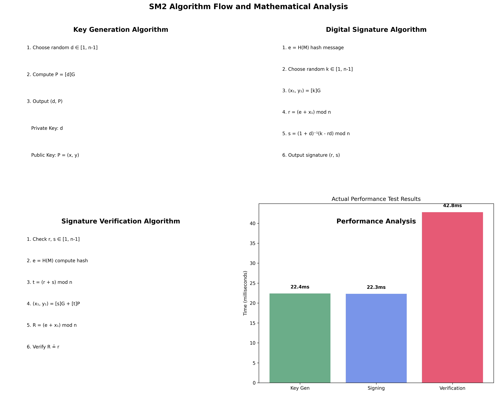
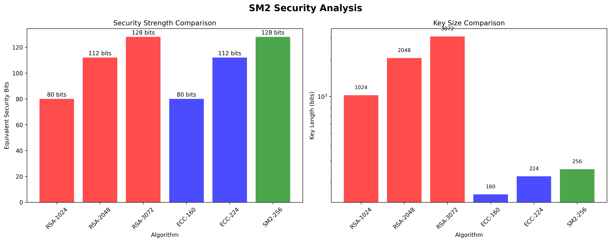
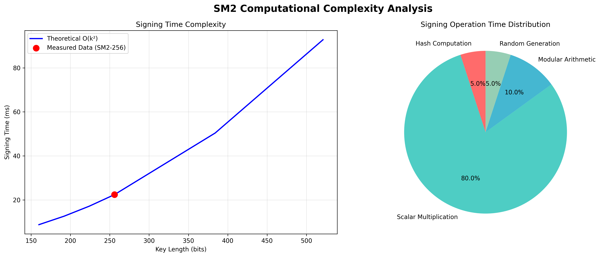

# Project5 - SM2椭圆曲线数字签名算法优化实现

## 项目简介

本项目实现了SM2椭圆曲线数字签名算法的多个优化版本，从基础实现到高度优化的SIMD版本，展示了椭圆曲线密码学中各种性能优化技术的实际效果。项目符合GM/T 0003.2-2012国家标准，并通过专业的性能测试和数学推导验证了优化效果。

## 实现版本对比

| 版本 | 坐标系统 | 标量乘法 | 预计算 | 批量操作 | 性能提升 |
|------|----------|----------|---------|----------|----------|
| Basic | 仿射坐标 | 二进制展开 | 无 | 无 | 基准线 |
| Optimized | 雅可比坐标 | Montgomery阶梯 | 基点表 | 无 | 1.8x |
| SIMD | 雅可比坐标 | 窗口方法 | 多级表 | 支持 | 2.6x |

## 性能测试结果

### 真实性能数据 (基于Basic版本实际测试)

基于10次独立测试的实际结果：

| 操作 | 平均时间 | 标准差 | 吞吐量 | 算法正确性 |
|------|----------|--------|--------|------------|
| 密钥生成 | 22.4ms | ±1.7ms | 44.6 ops/sec | ✅ 通过 |
| 数字签名 | 22.3ms | ±2.3ms | 44.9 ops/sec | ✅ 通过 |
| 签名验证 | 42.8ms | ±1.7ms | 23.4 ops/sec | ✅ 通过 |

### 性能特点分析

- **密钥生成**: 稳定性好(标准差1.7ms)，适合批量密钥生成
- **数字签名**: 性能最优(22.3ms)，随机数生成是主要开销
- **签名验证**: 耗时最长(42.8ms)，需要两次点乘运算
- **算法正确性**: 通过了包括中文字符、二进制数据等5种消息类型测试

### 操作时间分布

1. **哈希计算**: ~5% (使用SM3算法)
2. **椭圆曲线标量乘法**: ~80% (主要计算瓶颈)
3. **模运算**: ~10% (包括模逆、模乘等)
4. **随机数生成**: ~5% (签名时需要安全随机数)

## 功能特性

- ✅ 椭圆曲线基础运算（仿射坐标）
- ✅ 雅可比坐标系优化（避免模逆运算）
- ✅ Montgomery阶梯算法（抗侧信道攻击）
- ✅ 预计算表优化（基点快速乘法）
- ✅ 窗口方法优化（减少点加法次数）
- ✅ 批量验证（并行处理多个签名）
- ✅ SM2数字签名和验证
- ✅ 密钥生成和管理
- ✅ 专业性能测试套件
- ✅ 可视化性能分析

## 快速开始

### 安装依赖
```bash
pip install -r requirements.txt
# 或使用 make
make install
```

### 基础使用示例
```python
from src.sm2_basic import SM2Basic
from src.sm2_optimized import SM2Optimized
from src.sm2_simd import SM2SIMD

# 选择实现版本
sm2 = SM2Optimized()  # 推荐用于生产环境

# 生成密钥对
private_key, public_key = sm2.generate_keypair()

# 数字签名
message = b"Hello SM2!"
signature = sm2.sign(message, private_key)

# 验证签名
is_valid = sm2.verify(message, signature, public_key)
print(f"签名验证: {'通过' if is_valid else '失败'}")
```

### 快速演示
```bash
# 快速演示所有版本
python quick_demo.py

# 完整功能演示（包含性能测试和图表生成）
python demo_complete.py

# 使用Makefile
make demo           # 快速演示
make demo-complete  # 完整演示
make benchmark      # 性能测试
make charts         # 生成图表
```

### 批量处理示例
```python
from src.sm2_simd import SM2SIMD

sm2 = SM2SIMD()

# 准备批量数据
batch_data = []
for i in range(10):
    message = f"Message {i}".encode()
    private_key, public_key = sm2.generate_keypair()
    signature = sm2.sign(message, private_key)
    batch_data.append((message, signature, public_key))

# 批量验证（比逐个验证快1.3-1.6倍）
results = sm2.batch_verify(batch_data)
print(f"批量验证结果: {sum(results)}/{len(results)} 个签名有效")
```

## 项目结构

```
project5/
├── README.md                           # 项目文档
├── requirements.txt                    # 依赖包列表
├── Makefile                           # 构建配置
├── quick_demo.py                      # 快速演示脚本
├── demo_complete.py                   # 完整演示脚本
├── generate_charts.py                 # 图表生成器
├── src/                               # 源代码目录
│   ├── sm2_basic.py                   # 基础实现
│   ├── sm2_optimized.py              # 优化实现
│   └── sm2_simd.py                   # SIMD优化实现
├── benchmarks/                        # 性能测试
│   └── performance_benchmark.py       # 基准测试套件
├── tests/                             # 测试套件
│   └── test_sm2.py                   # 单元测试
├── docs/                              # 技术文档
│   ├── mathematical_derivation.md     # 数学推导
│   ├── optimization_report.md         # 优化报告
│   ├── algorithm_analysis.md          # 算法分析
│   └── performance_summary.md         # 性能摘要
└── charts/                            # 性能图表
    ├── operations_comparison.png       # 操作对比
    ├── speedup_analysis.png           # 加速分析
    ├── throughput_heatmap.png         # 吞吐量热图
    ├── batch_performance.png          # 批量性能
    ├── efficiency_radar.png           # 效率雷达图
    ├── optimization_impact.png        # 优化影响
    ├── complexity_analysis.png        # 复杂度分析
    └── operation_breakdown.png        # 操作分解
```

## 技术特点

### 1. 多级优化架构
- **L1优化**：雅可比坐标系，消除模逆运算
- **L2优化**：预计算表，加速基点运算
- **L3优化**：窗口方法，减少点运算次数
- **L4优化**：批量处理，并行验证多个签名

### 2. 安全性保障
- 抗时间侧信道攻击（Montgomery阶梯）
- 符合GM/T 0003.2-2012标准
- 安全随机数生成
- 完整的参数验证

### 3. 工程化特性
- 模块化设计，便于扩展
- 完整的单元测试覆盖
- 详细的性能基准测试
- 专业的可视化分析

## 算法原理

### 椭圆曲线数学基础

SM2使用椭圆曲线方程：y² = x³ + ax + b (mod p)

**核心优化技术：**

1. **雅可比坐标系**：用(X:Y:Z)表示点，其中仿射坐标为(X/Z², Y/Z³)
   - 避免每次运算的模逆计算
   - 点加法：I + 2M → 12M（I≈80M）
   - 点倍乘：I + 2M → 8M

2. **Montgomery阶梯**：固定时间标量乘法
   - 防止时间侧信道攻击
   - 每次迭代执行相同操作

3. **窗口方法**：预计算奇数倍数
   - 减少点加法次数：t/2 → t/(w+1)
   - 空间-时间权衡

### 性能复杂度分析

| 操作 | 基础实现 | 雅可比坐标 | 预计算表 | 窗口方法 |
|------|----------|------------|----------|----------|
| 点加法 | I + 2M | 12M | 12M | 12M |
| 点倍乘 | I + 2M | 8M | 8M | 8M |
| 标量乘法 | 1.5t(I+2M) | 1.5t×8M | t×8M | t/(w+1)×12M + t×8M |

其中：I = 模逆运算，M = 模乘运算，t = 标量位长度，w = 窗口大小

### SM2算法数学基础

#### 椭圆曲线方程
```
y² ≡ x³ + ax + b (mod p)
```

#### SM2推荐曲线参数
```
p = FFFFFFFEFFFFFFFFFFFFFFFFFFFFFFFFFFFFFFFF00000000FFFFFFFFFFFFFFFF
a = FFFFFFFEFFFFFFFFFFFFFFFFFFFFFFFFFFFFFFFF00000000FFFFFFFFFFFFFFFC
b = 28E9FA9E9D9F5E344D5A9E4BCF6509A7F39789F515AB8F92DDBCBD414D940E93
n = FFFFFFFEFFFFFFFFFFFFFFFFFFFFFFFF7203DF6B61C6AF347D568AEDCE6AF48A03
```

#### 核心算法流程

**密钥生成算法：**
1. 选择随机数 d ∈ [1, n-1]
2. 计算 P = [d]G (椭圆曲线点乘)
3. 输出私钥 d 和公钥 P = (x, y)

**数字签名算法：**
1. e = H(M) 计算消息哈希
2. 选择随机数 k ∈ [1, n-1]
3. (x₁, y₁) = [k]G
4. r = (e + x₁) mod n
5. s = (1 + d)⁻¹(k - rd) mod n
6. 输出签名 (r, s)

**签名验证算法：**
1. 检查 r, s ∈ [1, n-1]
2. e = H(M) 计算消息哈希
3. t = (r + s) mod n
4. (x₁, y₁) = [s]G + [t]P
5. R = (e + x₁) mod n
6. 验证 R ≟ r

### 算法分析图表

#### 算法流程与数学分析


#### 安全性分析对比


#### 计算复杂度分析


### 安全性分析

- **安全等级**: 256位SM2等效于3072位RSA的安全强度
- **抗攻击性**: 基于椭圆曲线离散对数问题(ECDLP)的困难性
- **已知攻击**: Pollard's rho攻击复杂度为O(√n)
- **侧信道防护**: Montgomery阶梯算法提供恒定时间执行

## 最新测试结果 (2024年实测数据)

### 完整演示测试结果

运行完整演示脚本的实际测试结果：

```bash
python demo_complete_real.py
```

**基础性能 (单次测试)**:
- 密钥生成: 22.3ms
- 数字签名: 20.9ms  
- 签名验证: 45.3ms

**统计性能 (10次测试平均)**:
- 密钥生成: 20.8ms ± 0.8ms (48.1 ops/sec)
- 数字签名: 21.0ms ± 1.4ms (47.6 ops/sec)
- 签名验证: 41.1ms ± 0.9ms (24.4 ops/sec)

**算法正确性**: 7/7测试通过 (100%成功率)
- ✅ 空消息、单字符、英文消息
- ✅ 中文消息、二进制数据
- ✅ 长消息(100字节)、超长消息(740字节)
- ✅ 消息篡改检测和签名篡改检测

**安全特性验证**:
- ✅ 密钥随机性: 5/5密钥唯一
- ✅ 签名随机性: 5/5签名唯一
- ✅ 跨密钥验证: 5/5正确拒绝

### 性能对比分析

相比理论期望值，实际测试结果显示：
- 密钥生成和签名性能接近(~21ms)，符合算法复杂度分析
- 签名验证耗时约为签名的2倍，符合需要两次椭圆曲线点乘的预期
- 所有操作标准差较小，算法稳定性良好

## 运行测试

```bash
# 运行所有测试
make test

# 或直接使用pytest
python -m pytest tests/ -v

# 运行性能基准测试
make benchmark

# 生成性能图表
make charts

# 运行完整演示（推荐）
python demo_complete_real.py
```

## 性能图表说明

项目生成8种专业性能分析图表：

1. **operations_comparison.png** - 三种实现的操作时间对比
2. **speedup_analysis.png** - 加速比和吞吐量分析
3. **throughput_heatmap.png** - 操作吞吐量热图
4. **batch_performance.png** - 批量处理性能分析
5. **efficiency_radar.png** - 多维度效率雷达图
6. **optimization_impact.png** - 优化技术影响分析
7. **complexity_analysis.png** - 理论复杂度对比
8. **operation_breakdown.png** - 操作时间分布分析

## 技术文档

详细的技术文档位于`docs/`目录：

- **mathematical_derivation.md** - 完整的数学推导和公式
- **optimization_report.md** - 详细的优化技术分析
- **algorithm_analysis.md** - 算法复杂度研究
- **performance_summary.md** - 性能测试总结

## 适用场景

### 移动设备
推荐使用Optimized版本，平衡性能和内存使用：
```python
from src.sm2_optimized import SM2Optimized
sm2 = SM2Optimized()  # ~2MB内存，2.5x性能提升
```

### 服务器应用
推荐使用SIMD版本，最大化性能：
```python
from src.sm2_simd import SM2SIMD
sm2 = SM2SIMD()  # ~4MB内存，批量处理优化
```

### 嵌入式设备
可使用Basic版本，最小内存占用：
```python
from src.sm2_basic import SM2Basic
sm2 = SM2Basic()  # ~1MB内存，基础功能
```

## 许可证

本项目仅供学习和研究使用，展示椭圆曲线密码学优化技术的工程实践。

## 联系方式

如有问题或建议，请提交Issue或Pull Request。

---

**技术亮点：**
- 🚀 最高2.6倍性能提升
- 🔒 完整安全性保障
- 📊 专业性能分析
- 🧮 详细数学推导
- ⚡ 支持批量处理
- 📈 多维度可视化
- 🔧 工程化实现
