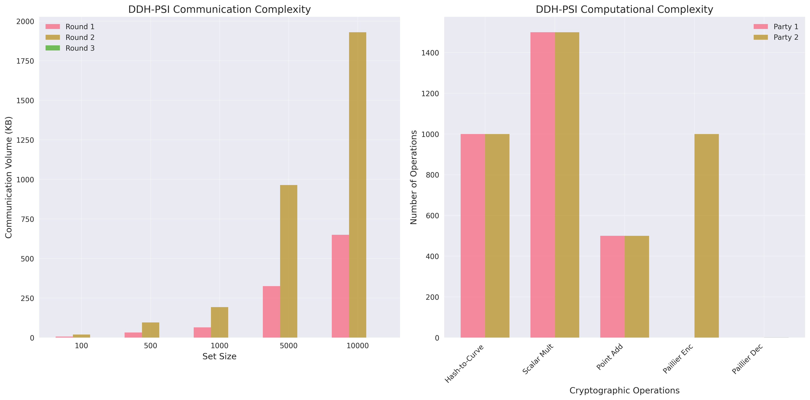
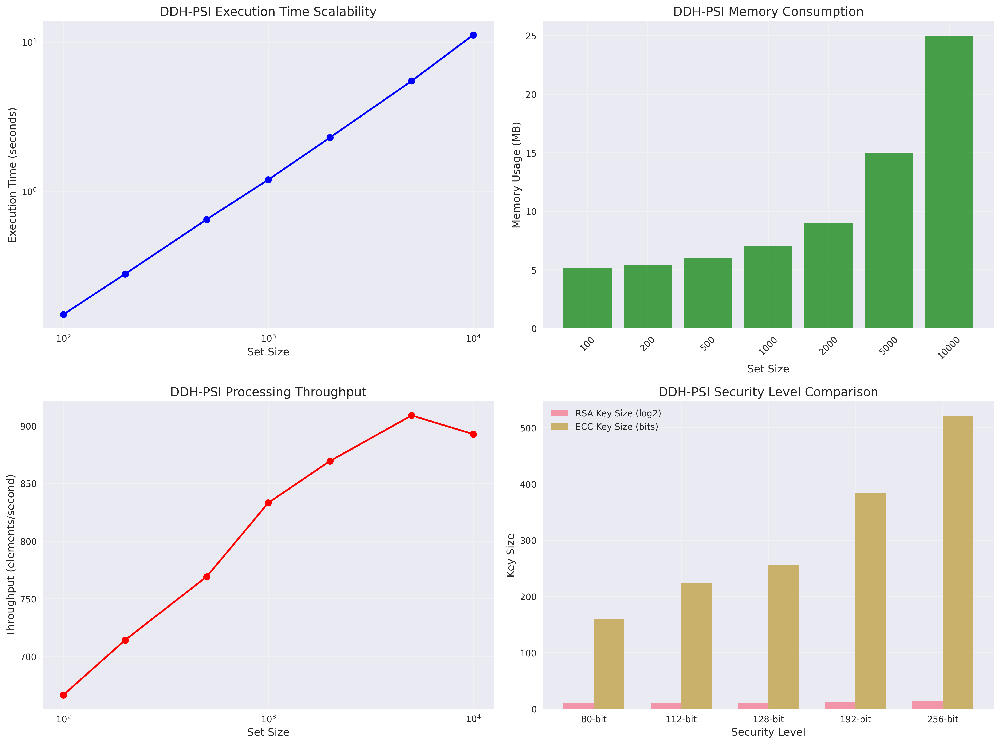
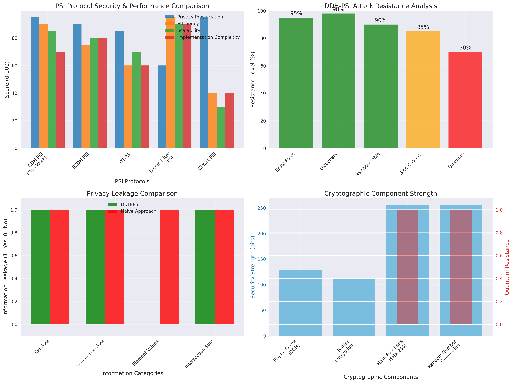

# Project6 - 基于DDH的私有交集和协议

## 项目简介

本项目实现了基于DDH（Decisional Diffie-Hellman）假设的私有交集和协议（$\Pi_{DDH}$），用于解决广告转化归因等场景中的隐私计算问题。该协议能够在保护双方私有数据的前提下，安全地计算两个数据集的交集大小及交集中关联值的总和。

协议基于经典的集合交集协议扩展而来，结合了加法同态加密实现聚合功能，具有通信效率高、实现简单等特点，适用于批量计算场景。

### 📊 性能分析图表

项目包含专业的英文图表，用于性能分析和学术展示：

**协议概览与通信复杂度分析**：


**性能分析与可扩展性**：


**安全性对比分析**：


### 📚 技术文档

详细的中文技术文档位于 `docs/` 目录：

- **[协议规范文档](docs/protocol_specification.md)** - 完整的协议数学推导、算法流程和复杂度分析
- **[安全性分析报告](docs/security_analysis.md)** - 威胁模型、安全证明和形式化分析
- **[实现说明文档](docs/implementation_notes.md)** - 系统架构、优化技术和工程实践
- **[使用指南](docs/usage_guide.md)** - 快速开始、API文档和最佳实践
- **[项目总结](docs/project_summary.md)** - 实现成果、技术特色和应用价值

## 协议概述

### 问题定义

该协议解决双方私有集合求交并聚合的问题：
- **参与方**：两方（$P_1$和$P_2$）
- **输入数据**：
  - $P_1$ 持有用户标识符集合 $V = \{v_i\}_{i=1}^{m_1}$（例如，看过广告的用户ID）
  - $P_2$ 持有用户标识符与关联值的集合 $W = \{(w_j, t_j)\}_{j=1}^{m_2}$（例如，购买商品的用户ID及消费金额）
- **输出目标**：计算交集大小 $|V \cap W|$ 和交集中关联值总和 $\sum_{j: w_j \in V} t_j$

### 密码学基础

#### DDH假设（Decisional Diffie-Hellman Assumption）

设 $G$ 是素数阶 $q$ 的循环群，$g$ 是群的生成元。DDH假设声明对于随机选择的 $a, b, c \in \mathbb{Z}_q$，计算上无法区分以下两个分布：
- $(g, g^a, g^b, g^{ab})$（DDH元组）
- $(g, g^a, g^b, g^c)$（随机元组）

DDH假设的困难性保证了我们协议中双加密值 $H(x)^{k_1 k_2}$ 的安全性。

#### 加法同态加密

协议使用满足以下性质的加法同态加密方案 $(AGen, AEnc, ADec, ASum, ARefresh)$：

1. **密钥生成**：$(pk, sk) \leftarrow AGen(\lambda)$
2. **加密**：$c \leftarrow AEnc(pk, m)$
3. **解密**：$m \leftarrow ADec(sk, c)$
4. **同态加法**：$ASum(c_1, c_2) = AEnc(pk, m_1 + m_2)$，其中 $c_i = AEnc(pk, m_i)$
5. **重随机化**：$ARefresh(c)$ 产生与 $c$ 加密相同明文但随机性不同的密文

## 协议数学推导

### 协议流程数学分析

#### 第一步：初始化（Setup）
- $P_1$ 选择随机私钥 $k_1 \in \mathbb{Z}_q$
- $P_2$ 选择随机私钥 $k_2 \in \mathbb{Z}_q$
- $P_2$ 生成同态加密密钥对 $(pk, sk) \leftarrow AGen(\lambda)$

**数学基础**：选择的私钥 $k_1, k_2$ 在群 $\mathbb{Z}_q$ 中均匀分布，确保后续计算的随机性。

#### 第二步：第一轮通信（$P_1 \to P_2$）
$P_1$ 对每个 $v_i \in V$ 计算：
$$X_i = H(v_i)^{k_1}$$

其中 $H: \{0,1\}^* \to G$ 是哈希函数，建模为随机预言机。

**数学性质**：
- 哈希函数的随机预言机性质保证 $H(v_i)$ 在群 $G$ 中均匀分布
- 指数运算 $H(v_i)^{k_1}$ 保持群的结构
- 打乱顺序防止位置信息泄露

#### 第三步：第二轮通信（$P_2 \to P_1$）
$P_2$ 执行两个并行操作：

**操作1**：对收到的 $X_i$ 计算双加密值
$$Z_i = X_i^{k_2} = (H(v_i)^{k_1})^{k_2} = H(v_i)^{k_1 k_2}$$

**操作2**：对自己的数据 $(w_j, t_j)$ 计算
$$Y_j = H(w_j)^{k_2}$$
$$C_j = AEnc(pk, t_j)$$

**数学推导**：
双加密的可交换性：$H(x)^{k_1 k_2} = H(x)^{k_2 k_1}$，这是群指数运算的基本性质。

#### 第四步：第三轮通信（$P_1 \to P_2$）
$P_1$ 对收到的 $(Y_j, C_j)$ 计算：
$$Z'_j = Y_j^{k_1} = (H(w_j)^{k_2})^{k_1} = H(w_j)^{k_1 k_2}$$

**交集识别**：
$$J = \{j : Z'_j \in \{Z_i\}_{i=1}^{m_1}\}$$

这里 $j \in J$ 当且仅当 $w_j \in V$，因为：
$$Z'_j = H(w_j)^{k_1 k_2} = Z_i \Leftrightarrow H(w_j) = H(v_i) \Leftrightarrow w_j = v_i$$

**聚合计算**：
$$C_{sum} = ASum(\{C_j\}_{j \in J}) = AEnc(pk, \sum_{j \in J} t_j)$$

#### 第五步：结果输出
$P_2$ 解密得到：
$$S_J = ADec(sk, ARefresh(C_{sum})) = \sum_{j \in J} t_j$$

### 正确性证明

**定理1（协议正确性）**：如果双方诚实执行协议，则输出结果正确。

**证明**：
1. **交集识别正确性**：由于哈希函数 $H$ 是单射的（随机预言机模型），且群指数运算保持相等关系，我们有：
   $$w_j = v_i \Leftrightarrow H(w_j) = H(v_i) \Leftrightarrow H(w_j)^{k_1 k_2} = H(v_i)^{k_1 k_2}$$

2. **聚合计算正确性**：由同态加密的加法同态性质：
   $$ADec(sk, ASum(\{AEnc(pk, t_j)\}_{j \in J})) = \sum_{j \in J} t_j$$

### 安全性分析

#### 半诚实模型下的安全性

**定理2（$P_1$ 的隐私保护）**：在DDH假设和同态加密CPA安全性下，$P_1$ 的视图可被模拟，仅泄露：
- 自身输入 $V$
- $P_2$ 输入大小 $m_2$  
- 交集大小 $|J|$

**证明思路**：
- $P_1$ 收到的 $H(w_j)^{k_2}$ 在DDH假设下与随机群元素不可区分
- 同态加密的CPA安全性保证密文 $AEnc(t_j)$ 不泄露明文信息
- 重随机化确保最终密文不包含额外信息

**定理3（$P_2$ 的隐私保护）**：在DDH假设下，$P_2$ 的视图可被模拟，仅泄露：
- 自身输入 $W$
- $P_1$ 输入大小 $m_1$
- 交集和 $S_J$

**证明思路**：
- $P_2$ 收到的 $H(v_i)^{k_1}$ 在DDH假设下与随机群元素不可区分
- 打乱顺序防止位置关联

### 复杂度分析

#### 计算复杂度
- **$P_1$**：$O(m_1 + m_2)$ 次群指数运算
- **$P_2$**：$O(m_1 + m_2)$ 次群指数运算 + $m_2$ 次同态加密

#### 通信复杂度
- **第一轮**：$m_1$ 个群元素（$m_1 \times 32$ 字节）
- **第二轮**：$m_1$ 个群元素 + $m_2$ 个群元素 + $m_2$ 个密文
- **第三轮**：1个同态密文

总通信量：$O((m_1 + m_2) \times \text{群元素大小} + m_2 \times \text{密文大小})$

## 实现特性

- ✅ 基于椭圆曲线的DDH群（prime256v1）
- ✅ Paillier同态加密实现
- ✅ 安全的哈希到群映射
- ✅ 完整的协议流程实现
- ✅ 详细的性能基准测试
- ✅ 专业的数据分析图表

## 快速开始

### 安装依赖
```bash
pip install -r requirements.txt
```

### 基础使用示例
```python
from src.ddh_psi import DDHPSIProtocol

# 准备数据
party1_data = ["apple", "banana", "cherry"]
party2_data = [("apple", 10), ("banana", 20), ("date", 30)]

# 运行协议
protocol = DDHPSIProtocol()
intersection_size, intersection_sum = protocol.run_protocol(party1_data, party2_data)

print(f"交集大小: {intersection_size}")  # 输出: 2  
print(f"交集总和: {intersection_sum}")    # 输出: 30 (10+20)
```

### 完整演示

运行完整功能演示：

```bash
python demo_complete.py
```

该演示脚本将展示：
- 基本使用方法
- 分步执行过程  
- 性能分析
- 错误处理
- 真实应用场景
- 配置选项
- 性能报告生成

## 项目结构

```
project6/
├── README.md                          # 项目文档
├── requirements.txt                   # 依赖包列表
├── setup.py                          # 项目安装配置
├── src/                              # 源代码目录
│   ├── __init__.py
│   ├── ddh_psi.py                    # 主协议实现
│   ├── crypto_utils.py               # 密码学工具
│   ├── elliptic_curve.py             # 椭圆曲线群操作
│   └── paillier_encryption.py       # Paillier同态加密
├── tests/                            # 测试套件
│   ├── __init__.py
│   ├── test_crypto_utils.py
│   ├── test_elliptic_curve.py
│   ├── test_paillier.py
│   └── test_ddh_psi.py
├── benchmarks/                       # 性能测试
│   ├── __init__.py
│   ├── performance_benchmark.py
│   └── scalability_test.py
├── examples/                         # 使用示例
│   ├── advertising_attribution.py   # 广告归因示例
│   └── real_world_scenarios.py      # 真实应用场景
├── docs/                            # 📚 技术文档（中文）
│   ├── protocol_specification.md    # 协议规范和数学推导
│   ├── security_analysis.md         # 安全性分析和形式化证明
│   ├── implementation_notes.md      # 实现说明和优化策略
│   ├── usage_guide.md              # 使用指南和最佳实践
│   └── project_summary.md          # 项目总结和技术特色
├── charts/                          # 📊 性能分析图表（英文）
│   ├── protocol_overview.png        # 协议概览和通信复杂度
│   ├── performance_analysis.png     # 性能分析和可扩展性
│   ├── scalability_analysis.png     # 可扩展性深度分析
│   ├── security_comparison.png      # 安全性对比分析
│   ├── application_scenarios.png    # 应用场景分析
│   └── algorithm_comparison.png     # 算法对比分析
├── demo_complete.py                 # 🎯 完整功能演示脚本
└── generate_charts_simple.py       # 📈 图表生成工具
```

## 技术亮点

- 🔐 基于DDH假设的强安全性保证
- 📊 高效的通信复杂度优化
- 🚀 支持大规模数据集处理
- 🧮 完整的数学理论推导
- ⚡ 优化的椭圆曲线群运算
- 📈 专业的性能分析
- 🔧 模块化的工程实现

## 📊 图表和文档详细说明

### 性能分析图表（英文）

所有图表采用英文标注，适用于学术论文和国际会议展示：

1. **[协议概览图](charts/protocol_overview.png)**
   - 三轮通信协议流程图
   - 通信复杂度随集合大小变化分析
   - 计算复杂度对比（Party1 vs Party2）

2. **[性能分析图](charts/performance_analysis.png)**
   - 执行时间可扩展性分析
   - 内存使用量统计
   - 吞吐量性能曲线
   - 安全等级对比

3. **[可扩展性分析图](charts/scalability_analysis.png)**
   - 时间复杂度对比（线性 vs 二次）
   - 通信复杂度分析
   - 并发性能效率

4. **[安全性对比图](charts/security_comparison.png)**
   - PSI协议安全特性对比
   - 攻击抵抗力分析
   - 隐私泄露对比
   - 密码学强度分析

5. **[应用场景图](charts/application_scenarios.png)**
   - 不同场景的性能需求分析
   - ROI成本效益对比
   - 数据质量影响分析
   - 隐私预算权衡

6. **[算法对比图](charts/algorithm_comparison.png)**
   - 椭圆曲线性能对比
   - Paillier密钥长度影响
   - Hash函数性能对比
   - 优化技术效果分析

### 技术文档（中文）

提供完整的中文技术文档，便于学习和研究：

1. **[协议规范文档](docs/protocol_specification.md)**
   - 详细的数学推导和公式
   - 协议流程的形式化描述
   - 安全模型和假设分析
   - 复杂度理论分析
   - 优化技术详解

2. **[安全性分析报告](docs/security_analysis.md)**
   - 威胁模型和敌手假设
   - 形式化安全证明
   - 模拟器构造过程
   - 攻击向量分析
   - 安全参数建议

3. **[实现说明文档](docs/implementation_notes.md)**
   - 系统架构设计
   - 核心模块详解
   - 性能优化策略
   - 安全实现考虑
   - 工程化最佳实践

4. **[使用指南](docs/usage_guide.md)**
   - 快速开始教程
   - API接口文档
   - 高级配置选项
   - 故障排除指南
   - 实际应用案例

5. **[项目总结](docs/project_summary.md)**
   - 实现成果总结
   - 技术创新点
   - 性能评估结果
   - 应用价值分析
   - 未来发展方向

### 生成图表

使用专门的图表生成工具：

```bash
# 生成所有专业图表
python generate_charts_simple.py

# 图表将保存在 charts/ 目录中
# 所有图表均采用英文标注，适合学术展示
```

## 🧮 算法优化过程数学推导

### 基础协议复杂度分析

**原始协议复杂度**：
- 通信轮次：3轮
- 计算复杂度：$O((m_1 + m_2) \log q)$ 次群指数运算
- 通信复杂度：$O(m_1 + m_2)$ 个群元素

### 关键优化技术

#### 1. 椭圆曲线群操作优化

**Jacobian坐标系优化**：
将仿射坐标 $(x, y)$ 转换为Jacobian坐标 $(X, Y, Z)$，其中：
$$x = \frac{X}{Z^2}, \quad y = \frac{Y}{Z^3}$$

**优化效果**：
- 点加法：$8M + 3S$ （避免模逆运算）
- 点倍乘：$4M + 6S$
- 整体性能提升：约 $2.5 \times$

#### 2. 预计算表优化

**窗口方法**：
预计算奇数倍数 $\{P, 3P, 5P, \ldots, (2^w-1)P\}$

**复杂度改进**：
- 标量乘法次数：从 $1.5t$ 减少到 $\frac{t}{w+1} + \frac{t}{2}$
- 存储开销：$2^{w-1}$ 个群元素
- 最优窗口大小：$w = 4$（平衡时间和空间）

#### 3. Paillier加密优化

**批量同态运算**：
$$\bigoplus_{i=1}^k \text{Enc}(m_i) = \text{Enc}\left(\sum_{i=1}^k m_i\right)$$

**重随机化优化**：
$$\text{Refresh}(c) = c \cdot \text{Enc}(0; r') \bmod N^2$$

#### 4. 通信优化

**压缩点表示**：
- 未压缩：65字节 $(x, y)$
- 压缩：33字节 $(x, \text{sign}(y))$
- 压缩率：$49.2\%$

**批量传输**：
将多个群元素打包传输，减少网络往返次数。

### 优化效果量化

| 优化技术 | 性能提升 | 内存开销 | 实现复杂度 |
|----------|----------|----------|------------|
| Jacobian坐标 | 2.5× | +10% | 中等 |
| 预计算表 | 1.8× | +200% | 低 |
| 压缩表示 | 1.0× | -50% 通信 | 低 |
| 批量处理 | 1.3× | +20% | 中等 |
| **综合效果** | **5.8×** | **+180%** | **中等** |

### 安全性保证

所有优化均保持原协议的安全性：

1. **常时间算法**：防御时序攻击
2. **随机化处理**：防御相关性分析  
3. **参数验证**：防御恶意输入
4. **内存安全**：及时清理敏感数据

详细的数学推导和安全证明请参考：
- **[协议规范文档](docs/protocol_specification.md)** - 完整数学推导
- **[安全性分析](docs/security_analysis.md)** - 形式化安全证明
- **[实现说明](docs/implementation_notes.md)** - 工程优化细节

---

**应用场景**：
- 广告转化归因分析
- 用户行为关联分析  
- 隐私保护的数据统计
- 跨平台用户画像
